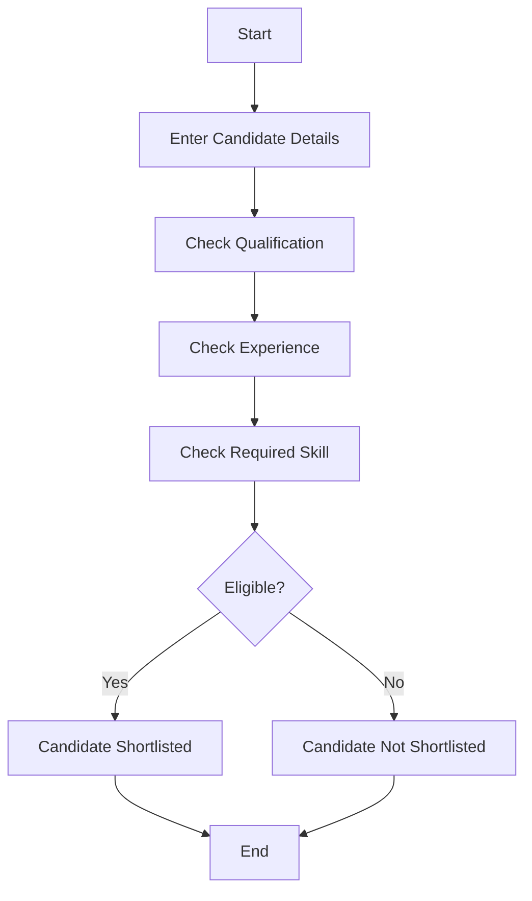
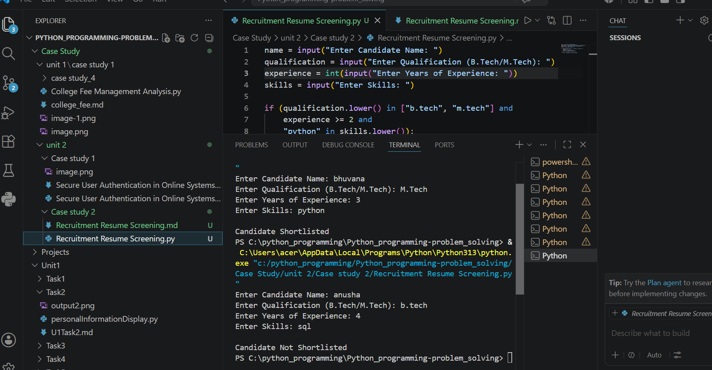

# Case Study 2: Recruitment Resume Screening

## 1. Problem Statement

Develop a Python application for recruitment resume screening that analyzes candidate details and shortlists applicants based on predefined eligibility criteria such as qualification, experience, and required skills.

---

# 2. Algorithm

1. Start the program.
2. Enter the candidate's name.
3. Enter qualification.
4. Enter years of experience.
5. Enter candidate skills.
6. Check whether:

   * Qualification is **B.Tech** or **M.Tech**.
   * Experience is **2 years or above**.
   * Candidate has the required skill (**Python**).
7. If all conditions are satisfied:

   * Display **"Candidate Shortlisted"**.
8. Otherwise:

   * Display **"Candidate Not Shortlisted"**.
9. Stop the program.

---

# 3. Flowchart (README.md)





---

# 4. Python Source Code

```python
name = input("Enter Candidate Name: ")
qualification = input("Enter Qualification (B.Tech/M.Tech): ")
experience = int(input("Enter Years of Experience: "))
skills = input("Enter Skills: ")

if (qualification.lower() in ["b.tech", "m.tech"] and
    experience >= 2 and
    "python" in skills.lower()):
    print("\nCandidate Shortlisted")
else:
    print("\nCandidate Not Shortlisted")
```

---

# 5. Sample Input / Output

### Sample Input 1

```text
Enter Candidate Name: Rahul
Enter Qualification (B.Tech/M.Tech): B.Tech
Enter Years of Experience: 3
Enter Skills: Python, SQL, Java
```

### Sample Output 1

```text
Candidate Shortlisted
```

---

### Sample Input 2

```text
Enter Candidate Name: Ramesh
Enter Qualification (B.Tech/M.Tech): B.Sc
Enter Years of Experience: 1
Enter Skills: C, HTML
```

### Sample Output 2

```text
Candidate Not Shortlisted
```

---

# 6. Screenshots

