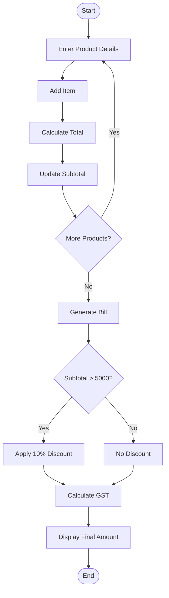
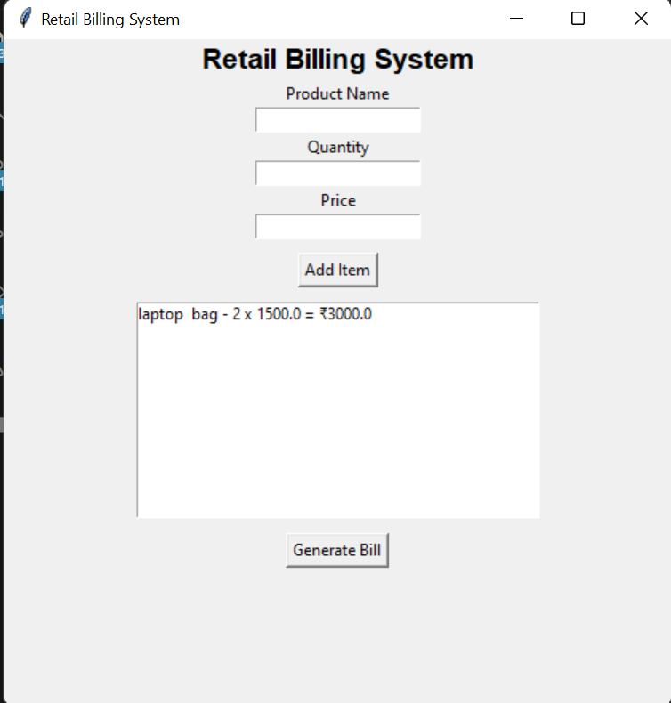

# Mini Project 4: Retail Billing System

## Problem Statement

Develop a Python-based billing system that generates invoices, applies discounts, and calculates taxes.

## Objective

The objective of this project is to automate the billing process in retail stores by generating invoices, applying discounts, calculating GST, and displaying the final payable amount through a graphical user interface.

## Features

- User-friendly GUI using Tkinter
- Add multiple products
- Quantity and price entry
- Automatic subtotal calculation
- 10% discount for bills above ₹5000
- GST calculation (18%)
- Invoice generation
- Final bill display

## Software Requirements

- Python 3.x
- Tkinter Library

## Algorithm

1. Start the application.
2. Enter product name, quantity, and price.
3. Click **Add Item**.
4. Calculate item total and update subtotal.
5. Repeat for all products.
6. Click **Generate Bill**.
7. Apply 10% discount if subtotal exceeds ₹5000.
8. Calculate GST at 18%.
9. Display invoice and final amount.
10. End.

## Flowchart



## Sample Input

```text
Product Name : Laptop Bag
Quantity     : 2
Price        : 1500

Product Name : Mouse
Quantity     : 3
Price        : 800
```

## Sample Output

```text
Subtotal : ₹5400.00
Discount : ₹540.00
GST (18%) : ₹874.80
Final Amount : ₹5734.80
```

## Conclusion

The Retail Billing System provides an efficient way to generate invoices, calculate discounts, and compute taxes automatically using a graphical interface.

### screenshot
