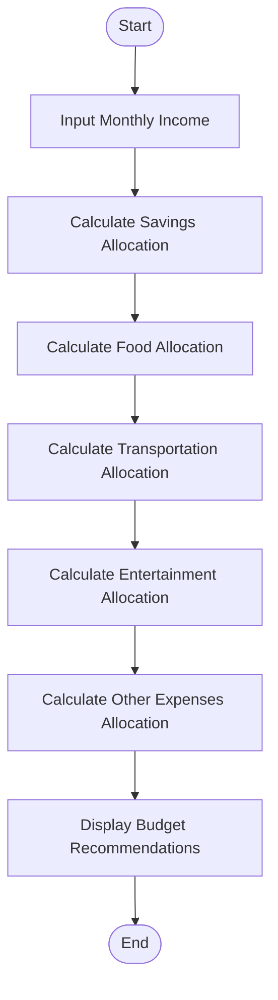
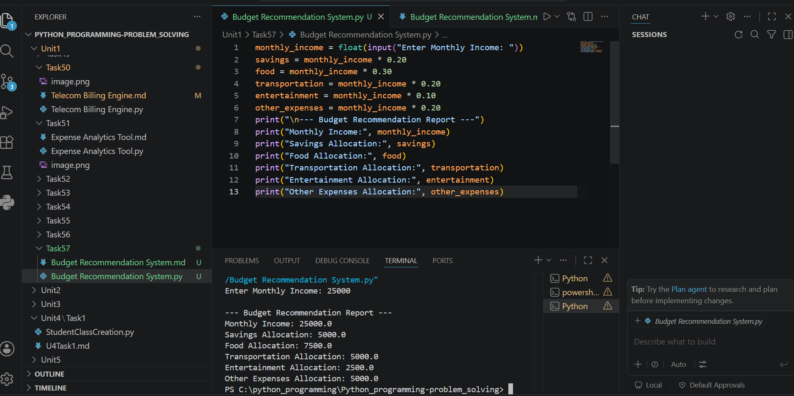

# Tutorial Task 57: Budget Recommendation System

## Problem Statement

Develop a Python application that recommends budget allocations based on user spending patterns.

---

## Algorithm

1. Start

2. Input monthly income.

3. Calculate budget allocations:

   * Savings = 20% of income
   * Food = 30% of income
   * Transportation = 20% of income
   * Entertainment = 10% of income
   * Other Expenses = 20% of income

4. Display the recommended budget allocation.

5. Stop.

---

## Flowchart



---

## Python Source Code

```python
monthly_income = float(input("Enter Monthly Income: "))

savings = monthly_income * 0.20
food = monthly_income * 0.30
transportation = monthly_income * 0.20
entertainment = monthly_income * 0.10
other_expenses = monthly_income * 0.20

print("\n--- Budget Recommendation Report ---")
print("Monthly Income:", monthly_income)
print("Savings Allocation:", savings)
print("Food Allocation:", food)
print("Transportation Allocation:", transportation)
print("Entertainment Allocation:", entertainment)
print("Other Expenses Allocation:", other_expenses)
```

---

## Sample Input/Output

### Input

```text
Enter Monthly Income: 50000
```

### Output

```text
--- Budget Recommendation Report ---
Monthly Income: 50000.0
Savings Allocation: 10000.0
Food Allocation: 15000.0
Transportation Allocation: 10000.0
Entertainment Allocation: 5000.0
Other Expenses Allocation: 10000.0
```

---

## Screenshot

> Run the program and save the output screenshot as `screenshot.png` in the repository folder.
